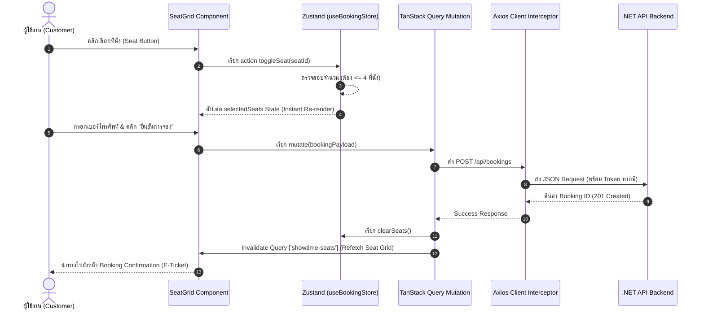

# Nature MiniPlex — Frontend Architecture

เอกสารนี้อธิบายถึงสถาปัตยกรรมทางเทคนิค การตัดสินใจเชิงโครงสร้าง (Architectural Decisions) และรูปแบบการไหลของข้อมูล (Data Flow Pattern) ของระบบ Nature MiniPlex Frontend

## 1. Next.js App Router & Rendering Strategy

เรารวมข้อดีของ **React Server Components (RSC)** และ **Client Components (`'use client'`)** เข้าด้วยกันอย่างเหมาะสม:

- **Server Components (Default):**
  - ใช้ใน Layout หลัก (`layout.tsx`), Header/Footer, และ static presentation pages
  - ทำการ Fetch ข้อมูลเบื้องต้นที่ระดับ Server ลดขนาด JavaScript Bundle ที่ต้องส่งไปยัง Browser
- **Client Components (`'use client'`):**
  - ใช้ในส่วนที่มี Interactivity สูง เช่น ผังเลือกที่นั่ง (`SeatGrid.tsx`), ฟอร์มข้อมูลการจอง (`BookingForm.tsx`), และ Admin Interactive Dashboards
  - มีการใช้งาน React Hooks (`useState`, `useEffect`, Custom Zustand/Query Hooks)

## 2. Component Hierarchy & Feature-Sliced Design

โครงสร้างโปรเจกต์แยกตาม **Feature Domains** เพื่อรองรับ Maintainability และ Scalability:

```text
src/
├── app/                  # Application Routes & Page Controllers
├── components/           # UI Components
│   ├── booking/          # SeatGrid, SeatButton, BookingForm, ShowtimePicker
│   ├── movies/           # MovieCard, MovieCardSkeleton
│   ├── layout/           # Navbar, Footer
│   └── ui/               # Generic Radix UI Primitives (Button, Dialog, Input)
├── features/             # Feature Domain Hooks (React Query)
│   ├── bookings/         # Custom hooks สำหรับ Booking API Mutations & Queries
│   ├── movies/           # Custom hooks สำหรับ Movie Data Fetching
│   └── showtimes/        # Custom hooks สำหรับ Showtime & Seat Grid Data
├── store/                # Zustand State Stores
│   ├── useBookingStore.ts# Selected Seats State Management
│   └── useAuthStore.ts   # Auth Cookie & User Session State
└── lib/                  # Infrastructure Configuration (Axios, QueryClient)
```

## 3. State Management Architecture

เราแบ่งแยก State ออกเป็น 2 ส่วนชัดเจนตามประเภทของข้อมูล (**Separation of Concerns**):

### A. Client Local State (Zustand)
- **`useBookingStore`**: จัดเก็บที่นั่งที่ผู้ใช้กำลังเลือกในหน่วยความจำ (`selectedSeats: number[]`)
- **SRS Rule Enforcement:** บังคับใช้เงื่อนไขจองได้ไม่เกิน 4 ที่นั่งภายใน Action `toggleSeat`:
  ```typescript
  toggleSeat: (seatId: number) => set((state) => {
    if (state.selectedSeats.includes(seatId)) {
      return { selectedSeats: state.selectedSeats.filter(id => id !== seatId) };
    }
    if (state.selectedSeats.length >= 4) return state; // Block exceeded selection
    return { selectedSeats: [...state.selectedSeats, seatId] };
  });
  ```
- **Atomic Selectors:** ใช้ Custom Selectors เพื่อให้ Component Re-render เฉพาะส่วนที่จำเป็น:
  ```typescript
  export const useIsSeatSelected = (seatId: number) =>
    useBookingStore((state) => state.selectedSeats.includes(seatId));
  ```

### B. Server State (TanStack Query v5)
- จัดการ Caching, Refetching และ Synchronization ของข้อมูลจาก Backend
- มีการกำหนด `staleTime` และ `gcTime` ที่เหมาะสมเพื่อลด Redundant API Requests
- การอัปเดตข้อมูลใช้ **Optimistic UI Updates** หรือ **Query Invalidation**:
  ```typescript
  onSuccess: (_, variables) => {
    void queryClient.invalidateQueries({ queryKey: ['showtime-seats', variables.showtimeId] });
  }
  ```

## 4. End-to-End Ticketing Data Flow



## 5. Security & Authentication Architecture

1. **Authentication Token Storage:**
   - บันทึก JWT Token ลงใน Cookie ชื่อ `admin_token` พร้อมตั้งค่า Path `/`
   - Axios Client ใช้ Interceptor เติม `Authorization: Bearer <token>` อัตโนมัติทุก Request
2. **Next.js Middleware Route Protection:**
   - ไฟล์ `src/middleware.ts` จะตรวจสอบ Cookie `admin_token` ในระดับ Server Edge สำหรับทราฟฟิกเข้าสู่ `/admin/*` หากไม่มีระบบจะ Redirect ไปยัง `/admin/login` ทันที
3. **Data Protection & Masking:**
   - เบอร์โทรศัพท์ของผู้จองตั๋วในผังที่นั่งจะผ่านฟังก์ชั่น `maskPhoneNumber()` ก่อนแสดงผลบนหน้าจอเสมอ เพื่อป้องกันข้อมูลส่วนบุคคลรั่วไหล
