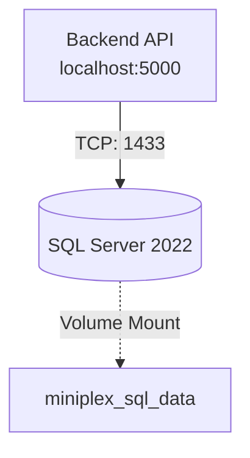

# Nature MiniPlex - Infrastructure (IaC)

[⬅️ กลับสู่หน้าแรก (Back to Root)](../README.md)
Directory นี้จัดเก็บไฟล์ตั้งค่าโครงสร้างพื้นฐาน (Infrastructure configuration), Scripts สำหรับ Deployment และระบบไปป์ไลน์ CI/CD ของโปรเจกต์ Nature MiniPlex โดยเรายึดหลักการแบบ **Infrastructure as Code (IaC)** เพื่อสร้าง Environment ที่สามารถนำกลับมาสร้างใหม่ได้ง่าย (Reproducible)

## 🐳 โครงสร้างพื้นฐานสำหรับการพัฒนาบนเครื่อง (Local Development)

เราใช้ Docker Compose สำหรับรัน Dependencies ที่จำเป็นต่อระบบ Backend เพื่อจำลอง Environment เสมือนจริง

### แผนภาพการเชื่อมต่อ (Local Architecture)



### วิธีรัน Local Services

ตรวจสอบให้แน่ใจว่าโปรแกรม **Docker Desktop** กำลังทำงานอยู่

1. **เตรียมไฟล์ Environment**:
   - คัดลอกไฟล์ `.env.example` ไปเป็น `.env` ในโฟลเดอร์ `infra`
   - ปรับแก้ไขรหัสผ่าน `SA_PASSWORD` หรือ Port ต่างๆ ให้ตรงตามต้องการ
   - *(ข้อควรระวัง: `infra/.env` ถูกตั้งค่าใน `.gitignore` แล้ว เพื่อป้องกันการเผลอ Commit รหัสผ่าน)*

2. **Start Services**:
   ```bash
   cd infra
   docker-compose up -d
   ```
   คำสั่งนี้จะทำการ Start บริการดังต่อไปนี้:
   - **SQL Server**: Relational Database หลักของระบบ (Port ตามที่ตั้งใน `.env` เช่น `1433`)

3. **Persistent Volumes**:
   ข้อมูลฐานข้อมูลจะถูกบันทึกไว้นอก Container ผ่านระบบ Docker Volumes (`miniplex_sql_data`) ทำให้ข้อมูลไม่หายไปแม้ว่าจะทำการ `docker-compose down`

4. **Stop Services**:
   เมื่อต้องการหยุดระบบ ให้รัน:
   ```bash
   docker-compose down
   ```
   *(หากต้องการลบข้อมูลใน Volume ด้วย ให้เพิ่ม Flag `-v` เข้าไป: `docker-compose down -v`)*

---

## 🚀 CI/CD Pipelines (GitHub Actions)

ระบบ Pipelines แบบอัตโนมัติของเราจะอยู่ในโฟลเดอร์ `.github/workflows/` (ที่ระดับ Repo Root)

- **CI Pipeline (Continuous Integration)**: จะถูกเรียกใช้งานทุกครั้งที่มีการเปิด Pull Request (PR) เข้าสู่ Branch `main`
  - ทำการรัน Code Linting / Formatting
  - ทำการรัน Unit Tests สำหรับ Backend และ Frontend
  - สรุป Test Coverage
- **CD Pipeline (Continuous Deployment)**: จะทำงานเมื่อ PR ถูก Merge เข้า `main`
  - สร้าง Docker Images ใหม่
  - พุช Image ขึ้น Container Registry
  - สั่ง Trigger การ Deploy ขึ้น Environment 

---

## ☁️ กลยุทธ์การ Deploy ขึ้น Cloud (Deployment Strategy)

- **Backend (API)**: จะถูกแพ็กเก็บในรูปแบบของ .NET Linux container มาตรฐาน 
- **Frontend (Web)**: จะถูกแพ็กเก็บในรูปแบบของ Next.js standalone container

*หมายเหตุ: รายละเอียดของ Cloud Provider (เช่น Azure Bicep หรือ AWS Terraform) จะถูกเพิ่มเข้ามาอัปเดตในโฟลเดอร์นี้ตามลำดับแผนการพัฒนาระยะถัดไป*

---

## 🌊 การจัดการสาขา (Git Flow)

โปรเจกต์นี้ใช้มาตรฐาน **Git Flow** ในการทำงาน สำหรับส่วนของ Infrastructure:
- การเปลี่ยนแปลง Configuration หรือ Scripts ต่างๆ ต้องทำผ่านกิ่ง `feature/*` ที่แตกออกจาก `develop`
- ทำตามข้อกำหนดการเปิด Pull Request ตามที่ระบุไว้ใน [CONTRIBUTING.md](../CONTRIBUTING.md)
