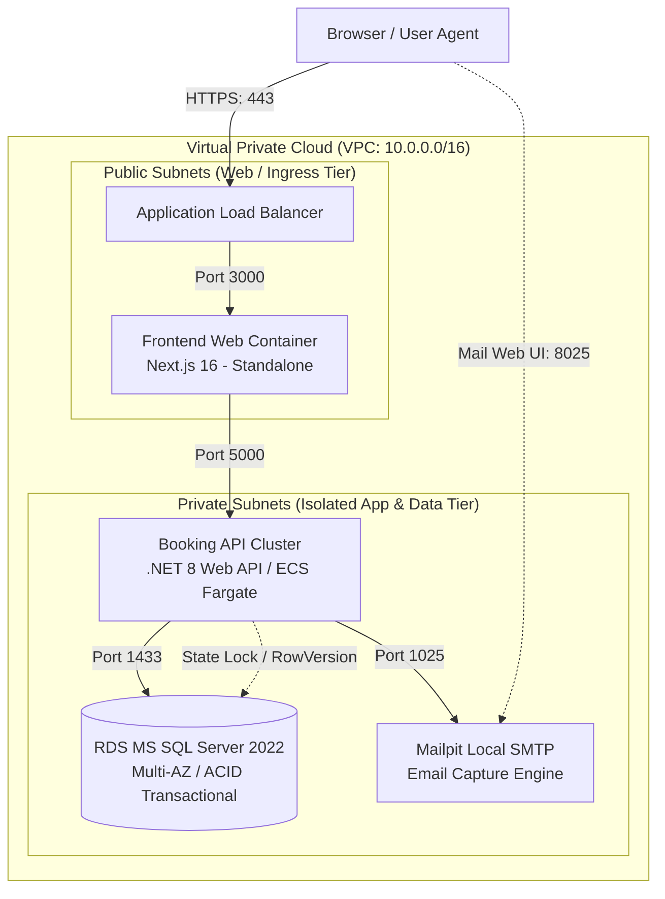
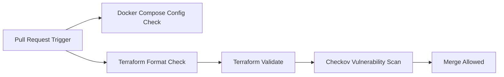

# Nature MiniPlex - Enterprise Infrastructure & IaC Standard

[⬅️ กลับสู่หน้าแรก (Back to Root Documentation)](../README.md)

ยินดีต้อนรับสู่ส่วนจัดการโครงสร้างพื้นฐาน (**Infrastructure as Code - IaC & Container Orchestration**) ของโปรเจกต์ **Nature MiniPlex** (ระบบจองตั๋วภาพยนตร์) เอกสารนี้อธิบายรายละเอียดสถาปัตยกรรมระบบ, การตั้งค่าสภาพแวดล้อม (Environment Variables), การรันระบบผ่าน Docker Compose สำหรับ Local Development, โครงสร้าง Terraform สำหรับ Enterprise Cloud Deployment, และระบบ CI/CD Automation ตามข้อกำหนด **Software Requirements Specification (SRS)**

---

## 🏛️ สถาปัตยกรรมระบบและการรองรับ SRS (Architecture & SRS Mapping)

ระบบรองรับการจองตั๋วภาพยนตร์แบบ Concurrency สูง (สูงสุด 4 ที่นั่งต่อรายการ) โดยป้องกันการจองซ้ำ (Double Booking 100%) ผ่านกลยุทธ์ Optimistic Concurrency (`RowVersion`) และรองรับการขยายระบบ (Autoscaling) อย่างเป็นอิสระ



### ตารางเปรียบเทียบ SRS Requirements กับ IaC Architecture Design

| SRS Requirement / Requirement Type | รายละเอียดข้อกำหนด (Requirement Detail) | การออกแบบในสถาปัตยกรรม IaC (Infrastructure Design) |
| :--- | :--- | :--- |
| **NFR1: Performance & Scalability** | API โหลดผังที่นั่ง < 500ms, รองรับทราฟฟิกช่วงตั๋วเปิดขาย | แยก Tier Compute ของ **Booking API (ECS Fargate)** ออกจาก Frontend/Database เพื่อทำ Target Tracking Autoscaling (2-10 Instances) ได้อย่างอิสระ |
| **NFR2: Data Integrity & Concurrency** | ป้องกันการจองที่นั่งซ้ำซ้อน 100% (Race Conditions) | จัดสรร **RDS SQL Server 2022 Multi-AZ** พร้อม ACID Transaction และรองรับ `RowVersion` Optimistic Concurrency Control ใน EF Core 8 |
| **NFR3: Security & Network Isolation** | Principle of Least Privilege และ 12-Factor Config | แยก Database และ API ไว้ใน **Private Subnets** ห้ามเข้าถึงตรงจากภายนอก, ปราศจาก Hardcoded Secrets โดยใช้ระบบ `.env` / AWS Secrets Manager |
| **Developer Frictionless Mode** | รันและทดสอบระบบได้ง่ายบนเครื่อง local (Zero Friction) | มี **Docker Compose** Orchestration ใน `infra/docker/` ครบทุก Service (`sqlserver`, `mailpit`, `backend`, `frontend`) รันได้ในคำสั่งเดียว |

---

## 📁 โครงสร้างไดเรกทอรีมาตรฐาน (Standardized Directory Tree)

```
infra/
├── .env.example                       # เทมเพลตตัวแปรสิ่งแวดล้อม (Committed to VCS)
├── .env                               # ค่าสเกลาร์สภาพแวดล้อม Local (Git-ignored)
├── .gitignore                         # ป้องกันการ Commit Secrets & Terraform State
├── README.md                          # เอกสารอธิบายสถาปัตยกรรมและการใช้งาน Infra
├── docker/                            # การจำลองระบบ Local Development
│   └── docker-compose.yml             # Container Orchestration (sqlserver, backend, frontend, mailpit)
└── terraform/                         # Enterprise Infrastructure as Code (IaC)
    ├── environments/                  # การจัดตั้งตามสภาพแวดล้อมใช้งาน
    │   ├── dev/
    │   │   ├── main.tf                # การประกอบ Modules และตั้งค่า S3 Remote State
    │   │   ├── outputs.tf             # ค่า Output หลักของ Dev Environment
    │   │   ├── terraform.tfvars.example # ตัวอย่างไฟล์ตารางตัวแปร Input
    │   │   └── variables.tf           # นิยามตัวแปร Input สำหรับ Dev
    │   ├── staging/                   # สภาพแวดล้อมจำลองเสมือนจริง (Staging Mirror)
    │   └── prod/                      # สภาพแวดล้อมใช้งานจริงแบบ Multi-AZ High Availability
    └── modules/                       # Reusable Infrastructure Modules
        ├── app_service/               # Compute Tier (ECS/Fargate Cluster & Autoscaling)
        │   ├── main.tf
        │   ├── outputs.tf
        │   └── variables.tf
        ├── database/                  # Managed Database Tier (ACID & Backup Retention)
        │   ├── main.tf
        │   ├── outputs.tf
        │   └── variables.tf
        └── networking/                # Network Tier (VPC, Public/Private Subnets, Gateways)
            ├── main.tf
            ├── outputs.tf
            └── variables.tf
```

---

## 🛠️ โหมดการรันระบบ Local (Flexible Execution Modes)

คุณสามารถเลือกรันระบบผ่าน **Docker Compose** (`infra/docker/docker-compose.yml`) ได้ 3 รูปแบบตามความต้องการ:

### 🔹 โหมดที่ 1: รันเฉพาะ Dependencies สำหรับการพัฒนา (Dev Dependencies Only)
> **เหมาะสำหรับการพัฒนาโค้ดบนเครื่องโฮสต์ (Hot-Reloading)**
> รันเฉพาะ Database (SQL Server) และ Mail Server (Mailpit) ใน Container แล้วเปิดรัน Backend (`dotnet run`) และ Frontend (`pnpm dev`) บนเครื่องของคุณเพื่อความรวดเร็วในการ Debug

```bash
cd infra/docker
cp ../.env.example .env 2>/dev/null || true
docker compose up -d sqlserver mailpit
```

---

### 🔹 โหมดที่ 2: รันเฉพาะบางบริการตามต้องการ (Individual Service Mode)
> **เลือกรันเฉพาะ Container ที่ต้องการทดสอบ:**

```bash
cd infra/docker

# รันเฉพาะ Database MS SQL Server
docker compose up -d sqlserver

# รันเฉพาะ Mailpit SMTP Server
docker compose up -d mailpit

# รันเฉพาะ Backend API (.NET 8 Container)
docker compose up --build -d backend

# รันเฉพาะ Frontend Web (Next.js 16 Container)
docker compose up --build -d frontend
```

---

### 🔹 โหมดที่ 3: รันแบบ Full-Stack ครบทุกบริการ (Full-Stack Container Mode)
> **เหมาะสำหรับผู้ตรวจข้อสอบสัมภาษณ์งาน (Reviewers / Evaluators)**
> สั่งรันครบทั้งระบบ (`sqlserver` + `mailpit` + `backend` + `frontend`) ในคำสั่งเดียวโดยไม่ต้องติดตั้ง .NET 8 SDK หรือ Node.js บนเครื่องโฮสต์

```bash
cd infra/docker
cp ../.env.example .env 2>/dev/null || true
docker compose up --build -d
```

---

## 🌐 ตารางแสดง Endpoints & Access Info

| บริการ (Service) | รายละเอียด (Description) | URL / Endpoint | บัญชีเข้าใช้งาน / ค่าเริ่มต้น |
| :--- | :--- | :--- | :--- |
| **Frontend Web** | หน้าเว็บ Next.js 16 SSR | [http://localhost:3000](http://localhost:3000) | - |
| **Backend API** | .NET 8 RESTful Booking API | [http://localhost:5000](http://localhost:5000) | - |
| **Swagger UI** | OpenAPI Interactive Spec | [http://localhost:5000/swagger](http://localhost:5000/swagger) | - |
| **Mailpit Web UI** | ตรวจสอบอีเมลทดสอบ (E-Ticket) | [http://localhost:8025](http://localhost:8025) | - |
| **Mailpit SMTP** | พอร์ตรับส่งอีเมล SMTP | `localhost:1025` | Port `1025` |
| **SQL Server** | MS SQL Server 2022 DB Port | `localhost:1433` หรือ `127.0.0.1:1433` | User: `sa` / Password: `${SA_PASSWORD}` |

---

## 🔌 การเชื่อมต่อฐานข้อมูลผ่าน SSMS (SQL Server Management Studio)

สำหรับนักพัฒนาที่ใช้ **Windows** ในการเปิด SSMS เชื่อมต่อกับ SQL Server บน **Docker (WSL2)**:

### 1. การกำหนด Server Name ตามสภาพแวดล้อม WSL2

- **กรณีใช้ WSL2 โหมดปกติ หรือ `networkingMode=mirrored`:**
  - **Server Name:** **`127.0.0.1,1433`** หรือ **`localhost,1433`**
  - *(ข้อควรระวัง: หากตั้งค่า `networkingMode=mirrored` ใน `.wslconfig` **ห้าม** ใช้ IP การ์ดจอ/Wi-Fi เช่น `172.xx.xx.xx` เพราะทราฟฟิกจะโดน Loopback Filter บล็อกและเกิด `Error 258: Timeout` ให้ใช้ `127.0.0.1,1433` เท่านั้น)*

### 2. การตั้งค่าในหน้าต่าง Connect to Server (SSMS)

```text
Server type:        Database Engine
Server name:        127.0.0.1,1433
Authentication:     SQL Server Authentication
Login:              sa
Password:           NaturePlex@2026!  (หรือตามค่า SA_PASSWORD ใน .env)
```

> [!IMPORTANT]
> **การตั้งค่า SSL Certificate (จำเป็นสำหรับ SSMS v19/v20):**
> 1. ในหน้าต่าง Connect to Server กดปุ่ม **`Options >>`**
> 2. ไปที่แถบ **Connection Properties**
> 3. 🔘 **ติ๊กถูกที่ช่อง [x] `Trust server certificate`**
> 4. เลือก **Encryption:** เป็น `Optional` หรือ `Mandatory` แล้วกด **Connect**

---

## 🔑 การจัดการตัวแปรสิ่งแวดล้อม (Environment Variables Reference)

ไฟล์ `.env` และ `.env.example` ในโฟลเดอร์ `infra/` ถูกวางโครงสร้างอย่างเป็นระเบียบครอบคลุมทุกส่วนของ Monorepo:

| ตัวแปร (Variable Name) | ค่าเริ่มต้น (Default Value) | คำอธิบาย (Description) |
| :--- | :--- | :--- |
| **DB_SERVER** | `sqlserver` | ชื่อ Service DB ใน Docker Network หรือ Host Domain |
| **DB_NAME** | `NatureMiniPlexDb` | ชื่อฐานข้อมูลหลักของโปรเจกต์ |
| **SA_PASSWORD** | `NaturePlex@2026!` | รหัสผ่านผู้ดูแลระบบ SQL Server (ต้องตรงตามนโยบายความปลอดภัย) |
| **SQL_PORT** | `1433` | พอร์ตภายนอกที่ Map เข้า SQL Server Container |
| **API_PORT** | `5000` | พอร์ตภายนอกของ Backend API |
| **FRONTEND_PORT** | `3000` | พอร์ตภายนอกของ Frontend Web App |
| **MAILPIT_SMTP_PORT** | `1025` | พอร์ต SMTP สำหรับส่งอีเมล |
| **MAILPIT_WEB_PORT** | `8025` | พอร์ตหน้าเว็บ UI สำหรับดูอีเมลที่ส่งออก |
| **CORS__ALLOWEDORIGINS** | `http://localhost:3000,...` | Origins ที่อนุญาตให้เรียกใช้งาน API |
| **JwtSettings__Secret** | `Development_Secret_Key...` | Key สำหรับสร้างและตรวจยืนยัน JWT Tokens (ความยาว ≥ 32 ตัวอักษร) |
| **SmtpSettings__Host** | `mailpit` | Hostname ของบริการส่งอีเมล SMTP |
| **NEXT_PUBLIC_MAX_SEATS_PER_BOOKING** | `4` | จำนวนที่นั่งสูงสุดต่อ 1 การจองตามข้อกำหนด SRS |

---

## 🔐 การบริหารจัดการ State & ความปลอดภัยใน Terraform (IaC)

### Remote State Storage & State Locking
ในการใช้งาน Terraform ระดับ Production โครงสร้างถูกออกแบบเป็น **Single Source of Truth** เพื่อป้องกัน Configuration Drift:
- **S3 Bucket (Remote Backend)**: เข้ารหัสข้อมูลที่จัดเก็บ (Server-Side Encryption via KMS) และเปิดใช้งาน Versioning
- **DynamoDB State Locking**: ป้องกันการสั่ง `terraform apply` พร้อมกันจากนักพัฒนาหลายคนหรือจาก CI/CD Runners

```hcl
terraform {
  backend "s3" {
    bucket         = "miniplex-tfstate-prod-us-east-1"
    key            = "prod/terraform.tfstate"
    region         = "us-east-1"
    dynamodb_table = "miniplex-tflocks-prod"
    encrypt        = true
  }
}
```

### การควบคุมความปลอดภัย (Security Standards)
- **Principle of Least Privilege**: กำหนด Security Group Rules ให้เฉพาะ Backend Tier เท่านั้นที่สามารถเชื่อมต่อกับ Database ในพอร์ต `1433` ได้
- **Zero Hardcoded Secrets**: ไม่อนุญาตให้ Hardcode Credentials ในไฟล์ `.tf` โดยใช้การฉีดค่าผ่าน Secret Manager หรือ Variables

---

## 🚀 ระบบตรวจสอบอัตโนมัติใน CI/CD Pipeline

ทุกการสร้าง Pull Request หรือ Push เข้ากิ่งหลัก จะถูกตรวจสอบโครงสร้างพื้นฐานอัตโนมัติผ่าน GitHub Actions Workflow ที่ `.github/workflows/infra-ci.yml`:



### การสั่งรันคำสั่งตรวจสอบด้วยตนเอง (Local Linting & Validation)

```bash
# 1. ตรวจสอบความถูกต้องของ Docker Compose Configuration
docker compose -f infra/docker/docker-compose.yml config --quiet

# 2. ตรวจสอบการจัดฟอร์แมตไฟล์ Terraform
terraform fmt -check -recursive infra/terraform

# 3. ตรวจสอบความถูกต้องของไวยากรณ์ Terraform (Dev Environment)
cd infra/terraform/environments/dev
terraform init -backend=false
terraform validate
```

---

## 🧹 การหยุดการทำงานและการล้างข้อมูล (Cleanup Commands)

```bash
cd infra

# หยุดการทำงานของ Containers ทั้งหมด
docker compose -f docker/docker-compose.yml down

# หยุดเฉพาะบางบริการ (เช่น backend และ frontend)
docker compose -f docker/docker-compose.yml stop backend frontend

# หยุดการทำงานและลบ Volume ฐานข้อมูล (Reset Data ทั้งหมดให้เริ่มต้นใหม่)
docker compose -f docker/docker-compose.yml down -v
```
